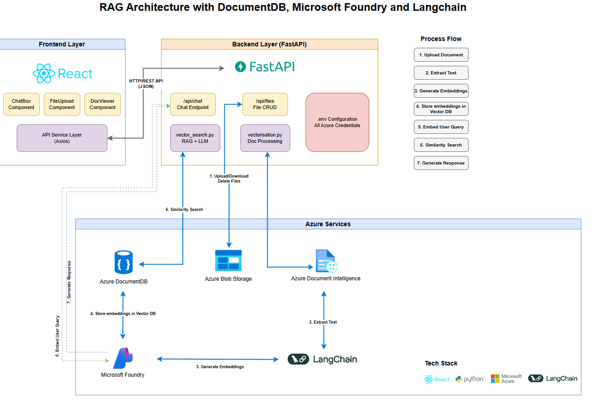

# Document Chat Assistant

A full-stack RAG (Retrieval Augmented Generation) application that allows users to upload documents and chat with them using AI. Built with FastAPI backend and React frontend, leveraging Azure services for document processing, vector search, and AI chat.

## Features

- 📄 **Document Upload**: Upload and process PDF, text, and image documents
- 💬 **AI-Powered Chat**: Ask questions about your documents with inline citations
- 🔍 **Vector Search**: Semantic search using Azure DocumentDB MongoDB vCore
- 📊 **Document Viewer**: View and manage uploaded documents with in-app rendering
- 🎨 **Modern UI**: Responsive React interface with Tailwind CSS
- ⚡ **Fast Performance**: Caching for embeddings, vector store, and LLM

## Tech Stack

### Backend
- **FastAPI**: Modern Python web framework
- **Azure OpenAI**: GPT models for chat and embeddings
- **Azure DocumentDB (MongoDB vCore)**: Vector database for semantic search
- **Azure Blob Storage**: Document storage
- **Azure Document Intelligence**: PDF and document processing
- **LangChain**: RAG implementation and vector search

### Frontend
- **React 18**: Modern UI framework
- **Vite**: Fast build tool
- **Tailwind CSS**: Utility-first styling
- **Axios**: HTTP client
- **Lucide React**: Icon library

## Prerequisites

- Python 3.8+
- Node.js 16+
- Azure subscription with the following resources:
  - Microsoft Foundry
  - Azure DocumentDB (MongoDB vCore)
  - Azure Blob Storage
  - Azure Document Intelligence
## Architecture



## Installation

### 1. Clone the repository

```bash
git clone <your-repo-url>
cd VectorDBApp
```

### 2. Backend Setup

```bash
# Install Python dependencies
pip install -r requirements.txt

# Copy environment template and configure
cp .env.example .env
# Edit .env with your Azure credentials and endpoints
```

### 3. Frontend Setup

```bash
cd frontend
npm install
cd ..
```

### 4. Configure Environment Variables

Edit `.env` file with your Azure credentials. **All values must be updated** - there are no defaults:

#### 1. Azure Document Intelligence (Form Recognizer)
Extract text and structure from PDFs and images.

```env
DOC_INTEL_ENDPOINT=https://your-doc-intel-resource.cognitiveservices.azure.com/
KEY=your-document-intelligence-key
```

#### 2. Azure DocumentDB (MongoDB vCore)
Vector database for storing document embeddings.

```env
MONGO_CLUSTER_NAME=your-cluster-name
COSMOS_MONGO_USER=your-username
COSMOS_MONGO_PWD=your-password
COSMOS_MONGO_SERVER=your-cluster.mongo.cosmos.azure.com
COSMOS_DB_NAME=testdb
COSMOS_COLLECTION_NAME=col1
```

#### 3. Microsoft Foundry
AI models for embeddings and chat.

```env
# Embedding Model (for vectorizing documents)
AZURE_OPENAI_EMBEDDING_ENDPOINT=https://your-openai-resource.cognitiveservices.azure.com/
AZURE_OPENAI_EMBEDDING_DEPLOYMENT=text-embedding-ada-002
AZURE_OPENAI_EMBEDDING_API_VERSION=2024-02-01

# Chat Model (for generating responses)
AZURE_FOUNDRY_CHAT_ENDPOINT=https://your-foundry-resource.cognitiveservices.azure.com
AZURE_FOUNDRY_CHAT_DEPLOYMENT=gpt-5.2-chat
AZURE_OPENAI_API_VERSION=2025-04-01-preview

# API Authentication
OPENAI_API_KEY=your-api-key
OPENAI_API_TYPE=azure
OPENAI_API_VERSION=2025-12-11
```

#### 4. Azure Blob Storage
Store uploaded documents.

```env
STORAGE_ACCOUNT_NAME=your-storage-account-name
STORAGE_ACCOUNT=https://your-storage-account.blob.core.windows.net/
STORAGE_KEY=your-storage-access-key
STORAGE_CON_NAME_RAW=sandbox
```

#### 5. Server Configuration (Optional - has defaults)
Backend server settings.

```env
HOST=0.0.0.0
PORT=8000
CORS_ORIGINS=http://localhost:3000,http://127.0.0.1:3000
```

## Running the Application

### Start Backend Server

```bash
# From project root
python main.py
# Or
uvicorn main:app --reload --port 8000
```

Backend will run on `http://localhost:8000`

### Start Frontend Development Server

```bash
cd frontend
npm run dev
```

Frontend will run on `http://localhost:3000`

## Project Structure

```
VectorDBApp/
├── main.py                 # FastAPI application entry point
├── requirements.txt        # Python dependencies
├── .env                    # Environment variables (not in git)
├── .env.example           # Environment template
├── .gitignore             # Git ignore rules
├── routes/
│   ├── chat.py            # Chat endpoint
│   └── filecrud.py        # File CRUD operations
├── services/
│   ├── vector_search.py   # RAG implementation
│   └── vectorisation.py   # Document processing & embeddings
└── frontend/
    ├── src/
    │   ├── App.jsx
    │   ├── components/
    │   │   ├── ChatBox.jsx
    │   │   ├── FileUpload.jsx
    │   │   └── DocumentViewer.jsx
    │   └── services/
    │       └── api.js
    ├── package.json
    └── vite.config.js
```

## API Endpoints

### Chat
- `POST /api/chat` - Send a message and get AI response with inline citations

### File Management
- `POST /api/files/upload` - Upload a document
- `GET /api/files` - List all documents
- `GET /api/files/{file_id}` - Get document content
- `DELETE /api/files/{file_id}` - Delete a document

## How It Works

1. **Document Upload**: Files are uploaded to Azure Blob Storage
2. **Processing**: Azure Document Intelligence extracts text from PDFs/images
3. **Embedding**: Text is chunked and embedded using Azure OpenAI embeddings
4. **Vector Storage**: Embeddings are stored in Azure Cosmos DB for MongoDB vCore (DocumentDB)
5. **Chat**: User queries are embedded and matched against stored vectors
6. **Response**: Relevant chunks are retrieved and sent to GPT for answer generation with inline citations

## Environment Variables Reference

| Variable | Description | Required |
|----------|-------------|----------|
| `DOC_INTEL_ENDPOINT` | Azure Document Intelligence endpoint | Yes |
| `KEY` | Document Intelligence API key | Yes |
| `MONGO_CLUSTER_NAME` | Cosmos DB cluster name | Yes |
| `AZURE_OPENAI_EMBEDDING_ENDPOINT` | Embedding model endpoint | Yes |
| `AZURE_OPENAI_EMBEDDING_DEPLOYMENT` | Embedding deployment name | Yes |
| `AZURE_FOUNDRY_CHAT_ENDPOINT` | Chat model endpoint | Yes |
| `AZURE_FOUNDRY_CHAT_DEPLOYMENT` | Chat deployment name | Yes |
| `STORAGE_ACCOUNT_NAME` | Azure Storage account name | Yes |
| `STORAGE_CON_NAME_RAW` | Container name for raw files | Yes |
| `HOST` | Server host (default: 0.0.0.0) | No |
| `PORT` | Server port (default: 8000) | No |
| `CORS_ORIGINS` | Allowed CORS origins | No |

## Security Notes

- **Never commit `.env` file** to version control
- Use Azure Managed Identity when possible
- Rotate API keys regularly
- Restrict CORS origins in production
- Use Azure Key Vault for sensitive credentials in production

## Deployment

### Backend Deployment (Azure App Service)

```bash
# Create App Service
az webapp up --name your-app-name --runtime PYTHON:3.11

# Configure environment variables in Azure Portal
# Application Settings -> New application setting
```

### Frontend Deployment

```bash
cd frontend
npm run build
# Deploy the 'dist' folder to your hosting service
# (Azure Static Web Apps, Vercel, Netlify, etc.)
```

## Troubleshooting

### Backend Issues

- **Import errors**: Ensure all dependencies are installed: `pip install -r requirements.txt`
- **Azure connection errors**: Verify credentials in `.env` file
- **CORS errors**: Check `CORS_ORIGINS` includes your frontend URL

### Frontend Issues

- **API connection errors**: Ensure backend is running on port 8000
- **Build errors**: Delete `node_modules` and run `npm install` again

## Contributing

1. Fork the repository
2. Create a feature branch
3. Make your changes
4. Test thoroughly
5. Submit a pull request

## License

MIT License - see LICENSE file for details

## Support

For issues and questions, please open an issue on GitHub.
